# Hi, I'm cxyfreedom

A senior backend developer from China, based in Shanghai. I regulary write articles on Obsidian.

## About Me

[](https://visitor-badge.laobi.icu/badge?page_id=cxyfreedom.cxyfreedom)
[](mailto:cxyfreedom@gmail.com)
[](https://github-readme-stats.vercel.app/api?username=cxyfreedom&hide_title=false&hide_border=true&show_icons=true&include_all_commits=true&line_height=20&bg_color=0,EC6C6C,FFD479,FFFC79,73FA79&theme=graywhite&locale=cn)
[](https://github.com/cxyfreedom?tab=followers)

## Tools

<a href="https://github.com" target="_blank">  </a> <a href="https://code.visualstudio.com/" target="_blank">  </a> <a href="https://obsidian.md/" target="_blank">  </a> <a href="https://www.centos.org/" target="_blank">  </a> <a href="https://postman.com" target="_blank" rel="noreferrer">  </a> <a href="https://www.jetbrains.com/pycharm/" target="_blank" rel="noreferrer">  </a>

## Technology Stack

<a href="https://www.djangoproject.com/" target="_blank" rel="noreferrer">  </a> <a href="https://www.docker.com/" target="_blank" rel="noreferrer">  </a> <a href="https://www.elastic.co" target="_blank" rel="noreferrer">  </a> <a href="https://flask.palletsprojects.com/" target="_blank" rel="noreferrer">  </a> <a href="https://git-scm.com/" target="_blank" rel="noreferrer">  </a> <a href="https://golang.org" target="_blank" rel="noreferrer">  </a> <a href="https://grafana.com" target="_blank" rel="noreferrer">  </a> <a href="https://gohugo.io/" target="_blank" rel="noreferrer">  </a> <a href="https://jasmine.github.io/" target="_blank" rel="noreferrer">  </a> <a href="https://developer.mozilla.org/en-US/docs/Web/JavaScript" target="_blank" rel="noreferrer">  </a> <a href="https://kafka.apache.org/" target="_blank" rel="noreferrer">  </a> <a href="https://www.elastic.co/kibana" target="_blank" rel="noreferrer">  </a> <a href="https://kubernetes.io" target="_blank" rel="noreferrer">  </a> <a href="https://www.linux.org/" target="_blank" rel="noreferrer">  </a> <a href="https://www.mongodb.com/" target="_blank" rel="noreferrer">  </a> <a href="https://www.mysql.com/" target="_blank" rel="noreferrer">  </a> <a href="https://www.nginx.com" target="_blank" rel="noreferrer">  </a> <a href="https://www.python.org" target="_blank" rel="noreferrer">  </a> <a href="https://www.rabbitmq.com" target="_blank" rel="noreferrer">  </a> <a href="https://redis.io" target="_blank" rel="noreferrer">  </a> 

## Stats



<p></p>




<!--START_SECTION:waka-->


**🐱 My GitHub Data** 

> 🏆 17 Contributions in the Year 2026
 > 
> 📦 204.8 kB Used in GitHub's Storage 
 > 
> 🚫 Not Opted to Hire
 > 
> 📜 60 Public Repositories 
 > 
> 🔑 3 Private Repositories  
 > 
**I'm an Early 🐤** 

```text
🌞 Morning    3 commits      █░░░░░░░░░░░░░░░░░░░░░░░░   4.62% 
🌆 Daytime    34 commits     █████████████░░░░░░░░░░░░   52.31% 
🌃 Evening    22 commits     ████████░░░░░░░░░░░░░░░░░   33.85% 
🌙 Night      6 commits      ██░░░░░░░░░░░░░░░░░░░░░░░   9.23%

```
📅 **I'm Most Productive on Saturday** 

```text
Monday       15 commits     █████░░░░░░░░░░░░░░░░░░░░   23.08% 
Tuesday      1 commits      ░░░░░░░░░░░░░░░░░░░░░░░░░   1.54% 
Wednesday    7 commits      ██░░░░░░░░░░░░░░░░░░░░░░░   10.77% 
Thursday     8 commits      ███░░░░░░░░░░░░░░░░░░░░░░   12.31% 
Friday       4 commits      █░░░░░░░░░░░░░░░░░░░░░░░░   6.15% 
Saturday     19 commits     ███████░░░░░░░░░░░░░░░░░░   29.23% 
Sunday       11 commits     ████░░░░░░░░░░░░░░░░░░░░░   16.92%

```


📊 **This Week I Spent My Time On** 

```text
💬 Programming Languages: 
Python                   7 hrs 25 mins       ███████████████████████░░   94.76% 
YAML                     16 mins             █░░░░░░░░░░░░░░░░░░░░░░░░   3.56% 
TOML                     4 mins              ░░░░░░░░░░░░░░░░░░░░░░░░░   1.03% 
Markdown                 1 min               ░░░░░░░░░░░░░░░░░░░░░░░░░   0.4% 
Docker                   1 min               ░░░░░░░░░░░░░░░░░░░░░░░░░   0.23%

🔥 Editors: 
PyCharm                  7 hrs 49 mins       █████████████████████████   100.0%

💻 Operating System: 
Mac                      7 hrs 49 mins       █████████████████████████   100.0%

```

**I Mostly Code in Python** 

```text
Python                   8 repos             █████████████░░░░░░░░░░░░   53.33% 
HTML                     3 repos             █████░░░░░░░░░░░░░░░░░░░░   20.0% 
Shell                    2 repos             ███░░░░░░░░░░░░░░░░░░░░░░   13.33% 
CSS                      1 repo              █░░░░░░░░░░░░░░░░░░░░░░░░   6.67% 
Markdown                 1 repo              █░░░░░░░░░░░░░░░░░░░░░░░░   6.67%

```


 Last Updated on 17/02/2026
<!--END_SECTION:waka-->

<!--
**cxyfreedom/cxyfreedom** is a ✨ _special_ ✨ repository because its `README.md` (this file) appears on your GitHub profile.

Here are some ideas to get you started:

- 🔭 I’m currently working on ...
- 🌱 I’m currently learning ...
- 👯 I’m looking to collaborate on ...
- 🤔 I’m looking for help with ...
- 💬 Ask me about ...
- 📫 How to reach me: ...
- 😄 Pronouns: ...
- ⚡ Fun fact: ...
-->
